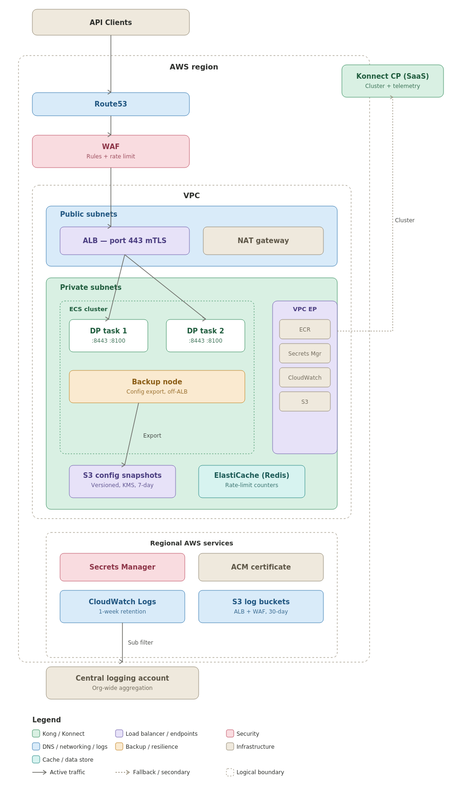

# Kong Konnect ECS Data Plane — Architecture Diagram

```mermaid
graph TB
    subgraph INTERNET["Internet"]
        CLIENT[mTLS API Clients]
    end

    subgraph KONNECT["Kong Konnect SaaS"]
        KONNECT_CP[Konnect Control Plane\nCluster + Telemetry Endpoints\nManaged by Kong]
    end

    subgraph PRIMARY["AWS Primary Region — Infrastructure + Service Stacks"]
        subgraph R53_PRIMARY["Route53 — Failover DNS"]
            R53_ALB_P[ALB record\nFAILOVER PRIMARY]
            R53_HC[Health Check\nHTTPS /health\n30s interval]
        end

        subgraph VPC["VPC  —  Primary Region"]
            subgraph PUBLIC["Public Subnets"]
                ALB[Application Load Balancer\nInternet-facing\nPort 443 — mTLS]
                NAT[NAT Gateway\nOutbound internet]
            end

            subgraph PRIVATE["Private Subnets"]
                subgraph ECS["ECS Cluster  per service"]
                    DP1[Kong DP Task\nARM64 Fargate\nProxy :8443\nStatus :8100]
                    DP2[Kong DP Task\nARM64 Fargate\nProxy :8443\nStatus :8100]
                    BACKUP[Backup Node\nARM64 Fargate\nConfig export only\nnot in ALB target group]
                end

                subgraph VPC_EP["VPC Interface Endpoints"]
                    ECR_EP[ECR API + Docker]
                    SM_EP[Secrets Manager]
                    CW_EP[CloudWatch Logs]
                    S3_EP[S3 Gateway]
                end
            end
        end

        subgraph REGIONAL_SERVICES["Regional AWS Services"]
            ALB_CERT[ACM Certificate\nALB domain]
            ALB_WAF[WAF — Regional scope\nManaged Rules\nRate Limiting\nCIDR Restriction]
            SM[Secrets Manager\nKonnect cluster cert + key\nKonnect CP endpoints\nKong SSL cert + key]
            S3_DP[S3 Bucket — DP Resilience\nKong config snapshots\nVersioned  7-day retention\nKMS encrypted]
            S3_LOGS[S3 Bucket — ALB access logs\nWAF logs\n30-day retention]
            CW_LOGS[CloudWatch Logs\nECS task logs\nVPC flow logs\n1-week retention]
        end
    end

    subgraph SECONDARY["AWS Secondary Region — Mirror Stack"]
        R53_ALB_S[ALB record\nFAILOVER SECONDARY]
        VPC2[VPC + ALB + ECS\nidentical configuration]
    end

    subgraph CENTRAL_ACCT["Central AWS Account — Logging"]
        CENTRAL_LOG[CloudWatch Logs Destination\nAggregated org-wide logs]
    end

    %% Client traffic
    CLIENT -->|HTTPS mTLS port 443| ALB

    %% WAF association
    ALB_WAF -.->|associated| ALB

    %% ALB to Kong DP — path-based routing
    ALB -->|path rules\nHealthCheck: HTTP :8100/status/ready| DP1
    ALB -->|path rules\nHealthCheck: HTTP :8100/status/ready| DP2

    %% Kong DP to Konnect
    DP1 -->|cluster mTLS\ntelemetry| KONNECT_CP
    DP2 -->|cluster mTLS\ntelemetry| KONNECT_CP
    BACKUP -->|cluster mTLS\nreceives config updates| KONNECT_CP

    %% DP Resilience
    BACKUP -->|KONG_CLUSTER_FALLBACK_CONFIG_EXPORT=on\nwrites config snapshot| S3_DP
    DP1 -.->|KONG_CLUSTER_FALLBACK_CONFIG_IMPORT=on\nreads on startup if CP unreachable| S3_DP
    DP2 -.->|KONG_CLUSTER_FALLBACK_CONFIG_IMPORT=on\nreads on startup if CP unreachable| S3_DP

    %% Secrets
    DP1 -.->|reads at task start| SM
    DP2 -.->|reads at task start| SM
    BACKUP -.->|reads at task start| SM

    %% VPC Endpoints used by ECS tasks
    DP1 & DP2 & BACKUP -.-> ECR_EP & SM_EP & CW_EP & S3_EP

    %% Cert
    ALB_CERT -.->|attached to listener| ALB

    %% Logging
    DP1 & DP2 & BACKUP -->|stdout/stderr| CW_LOGS
    CW_LOGS -->|subscription filter| CENTRAL_LOG
    ALB -.->|access logs| S3_LOGS

    %% Route53 failover
    R53_HC -.->|monitors| ALB
    R53_ALB_P -.->|primary failover record| VPC
    R53_ALB_S -.->|secondary failover record| VPC2
    R53_ALB_P -.->|failover pair| R53_ALB_S

    %% Styling
    classDef aws fill:#ff9900,stroke:#232f3e,stroke-width:2px,color:#fff
    classDef kong fill:#003459,stroke:#00d4aa,stroke-width:2px,color:#fff
    classDef security fill:#dd344c,stroke:#232f3e,stroke-width:2px,color:#fff
    classDef external fill:#232f3e,stroke:#00d4aa,stroke-width:2px,color:#fff
    classDef storage fill:#3f48cc,stroke:#232f3e,stroke-width:2px,color:#fff
    classDef saas fill:#00d4aa,stroke:#003459,stroke-width:2px,color:#003459

    class ALB,NAT,ALB_CERT,ECR_EP,SM_EP,CW_EP,S3_EP,R53_HC,R53_ALB_P,R53_ALB_S aws
    class DP1,DP2,BACKUP kong
    class ALB_WAF,SM security
    class CLIENT external
    class S3_DP,S3_LOGS,CW_LOGS,CENTRAL_LOG storage
    class KONNECT_CP saas
    class VPC2 aws
```

## Component Details

### Traffic Flow

All API clients connect directly to the ALB on port 443 using mTLS — client certificates are validated against an ACM Private CA trust store. The ALB routes requests to Kong DP tasks using path-based listener rules (e.g. `/customers`, `/customers/*`).

### Stack Breakdown

#### Infrastructure Stack (regional)
- **VPC**: Public + private subnets, NAT Gateway, VPC interface endpoints (ECR, Secrets Manager, CloudWatch Logs) and S3 gateway endpoint; optional Transit Gateway attachment
- **Application Load Balancer**: Internet-facing; port 443 with mTLS trust store validation
- **ACM Certificate**: Covers the ALB custom domain, DNS-validated via Route53
- **WAF (Regional scope)**: AWS Managed Rules (Common, Known Bad Inputs, IP Reputation), rate limiting (default 2000 req/min, HTTP 429), optional CIDR allowlist
- **Route53 Failover**: Health check on HTTPS `/health`; primary region is FAILOVER PRIMARY, secondary is FAILOVER SECONDARY — automatic DNS cutover on health check failure

#### Service Stack (one per service, regional)
- **ECS Cluster**: Fargate ARM64; configurable CPU (default 512 units), memory (default 1024 MiB), replicas (default 2)
- **Kong Data Plane Tasks**: `KONG_ROLE=data_plane`, `KONG_DATABASE=off`, Konnect mode; proxy on :8443 (HTTPS/HTTP2), status on :8100
- **Backup Node**: 1 replica, not registered with ALB; exports Kong config to S3 (`KONG_CLUSTER_FALLBACK_CONFIG_EXPORT=on`); regular DP tasks import on startup if CP is unreachable
- **ALB Listener Rules**: Path-based routing on port 443 mTLS listener (e.g. `/customers`, `/customers/*`)
- **IAM Roles**: Task execution role (pull images, read secrets, S3 access for DP resilience); task role (CloudWatch Logs, S3, Lambda invoke for AWS Lambda plugin, STS AssumeRole)

### Security Layers

1. **WAF** — filters traffic at ALB level; AWS managed rules + rate limiting + optional CIDR allowlist
2. **mTLS (port 443)** — client certificates validated against an ACM Private CA trust store
3. **Konnect cluster mTLS** — Kong DP authenticates to Konnect using PKI certificates stored in Secrets Manager
4. **VPC Endpoints** — ECR image pulls, Secrets Manager reads, CloudWatch writes, S3 access all stay within the VPC

### Multi-Region Failover

Both primary and secondary regions deploy identical Infrastructure and Service stacks. A Route53 health check monitors `HTTPS /health` on the ALB every 30 seconds; three consecutive failures trigger automatic DNS failover to the secondary region.

### Data Plane Resilience

A dedicated Backup Node ECS task (1 replica, off-load-balancer) stays connected to the Konnect Control Plane and continuously exports the current Kong configuration to an S3 bucket. Regular data plane tasks set `KONG_CLUSTER_FALLBACK_CONFIG_IMPORT=on`; if Konnect is unreachable at startup, Kong reads the last-known configuration from S3 and continues serving traffic without a live control plane connection.

### Logging

ECS task logs (stdout/stderr) are sent to CloudWatch Logs with a 1-week retention period. VPC flow logs are also written to CloudWatch. CloudWatch subscription filters forward all log groups to a central AWS account destination ARN for organisation-wide log aggregation. ALB access logs and WAF logs are written to dedicated S3 buckets with 30-day retention.
