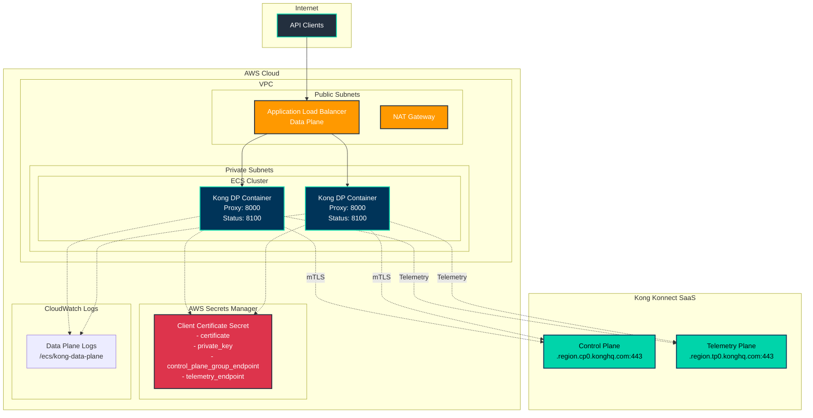

# Kong Konnect Hybrid Architecture

## Architecture Components

### Kong Konnect (SaaS)
- **Control Plane**: Manages configuration and policies
- **Telemetry Plane**: Collects metrics and analytics

### AWS Infrastructure
- **ECS Fargate**: Runs Kong data plane containers
- **Application Load Balancer**: Routes traffic to data plane
- **VPC**: Network isolation with public/private subnets
- **Secrets Manager**: Stores client certificates securely
- **CloudWatch Logs**: Centralized logging

### Security
- **mTLS**: Secure communication between data plane and Konnect
- **Client Certificates**: PKI-based authentication
- **Private Subnets**: Data plane isolated from internet
- **IAM Roles**: Least privilege access to secrets

### Data Flow
1. API clients send requests to ALB
2. ALB routes to Kong data plane containers
3. Data plane connects to Konnect control plane via mTLS
4. Telemetry data sent to Konnect telemetry plane
5. Logs streamed to CloudWatch